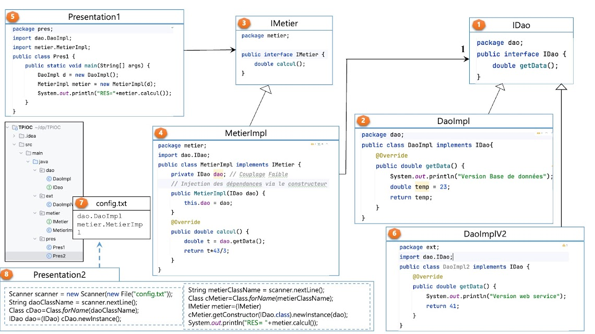

# Exemple d'Injection de Dépendances en Java

Ce projet démontre le concept d'**Injection de Dépendances (DI)** en Java, en utilisant des interfaces, des implémentations concrètes, et le chargement dynamique des classes via un fichier de configuration.

## Structure du Projet

Le système est composé des éléments suivants :

1. **Interface IDao** : Déclare la méthode `getData()` pour l'accès aux données.
2. **DaoImpl** : Implémente `IDao` et simule l'accès aux données depuis une base de données.
3. **Interface IMetier** : Déclare la méthode `calcul()` pour la logique métier.
4. **MetierImpl** : Implémente `IMetier`, dépend de `IDao` via l'injection par constructeur.
5. **Presentation1** : Exemple de couplage fort (instanciation directe des classes `DaoImpl` et `MetierImpl`).
6. **DaoImplV2** : Autre implémentation de `IDao`, simule un accès aux données via un service web.
7. **config.txt** : Contient les noms des classes à charger dynamiquement.
8. **Presentation2** : Exemple de couplage faible .

## Schéma du Projet

## Points Clés

- **Couplage Faible** : Obtenu grâce aux interfaces et au chargement dynamique des classes .
- **Injection de Dépendances** : La classe `MetierImpl` reçoit sa dépendance (`IDao`) par constructeur.
- **Flexibilité** : Il suffit de modifier le fichier `config.txt` pour changer l'implémentation de `IDao` sans toucher au code source.

